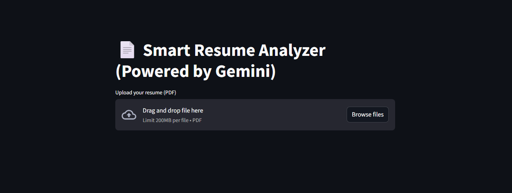
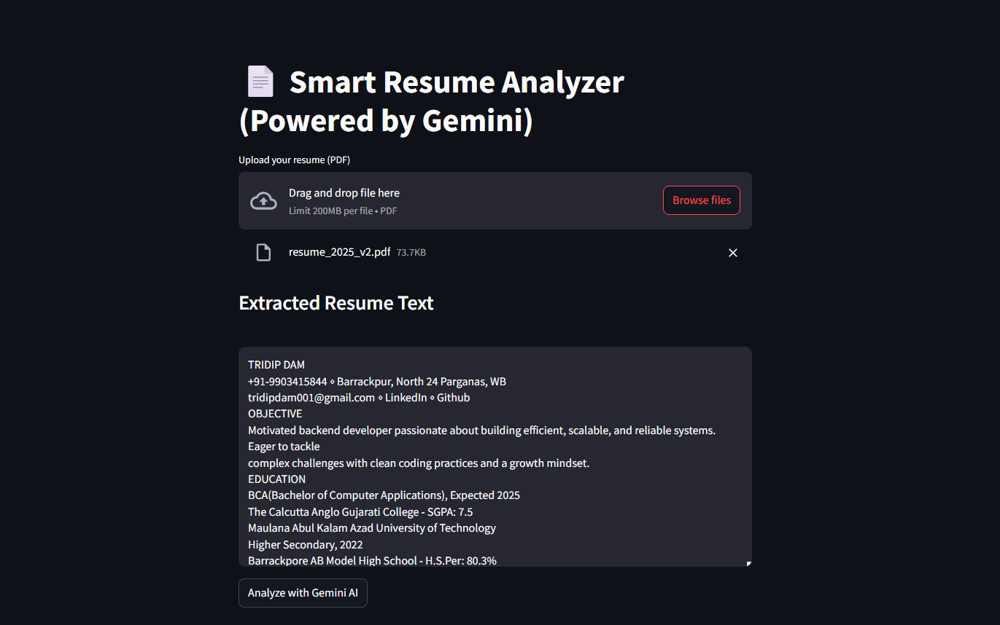
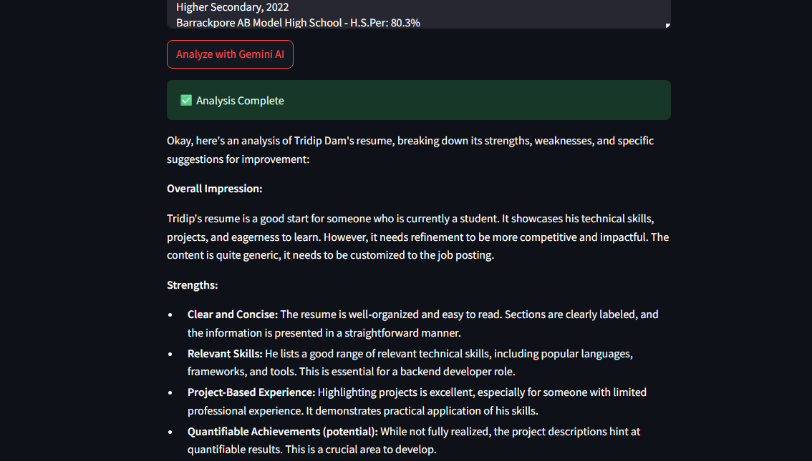

# 📄 Smart Resume Analyzer (AI-Powered)

An AI-powered resume analyzer built with **Streamlit**, **Google Gemini (Bard)**, and **Python**. Upload a PDF resume, analyze its strengths and weaknesses, and match it with a job description to receive fit scores and improvement tips.

---

## 🚀 Features

- 📄 Extract and display resume text from uploaded PDF
- 🤖 AI-powered resume review using Gemini Pro
- 🎯 Job matching with skill gap analysis and fit score
- 💡 Suggestions to improve resume alignment with job roles

---

## 🖼️ Demo Screenshot



---


---


---


---

## 🧠 Technologies Used

- [Streamlit](https://streamlit.io/) – UI framework
- [Google Generative AI (Gemini)](https://ai.google.dev) – AI resume analysis
- [pdfplumber](https://github.com/jsvine/pdfplumber) – PDF text extraction
- Python

---

## 📦 Installation

1. **Clone the repo**
   ```bash
   git clone https://github.com/Ricky004/AI_resume_reviewer.git
   cd smart-resume-analyzer
